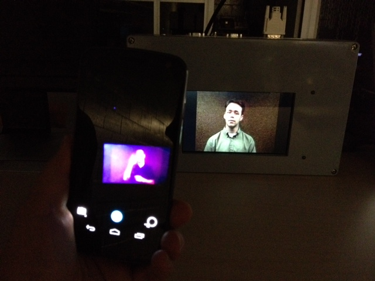

AidQRApp
=========

The code is based on the Flash Illuminated QR Code scanning App for a different project I worked on. It utilized the [ZXing](https://github.com/zxing/zxing/) libary.

For a description of its usage, see my new [ubicomp](http://ubicomp.org/ubicomp2014/) paper.

